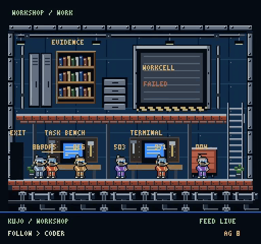

# Kujo Agent City

<p align="center">
  <a href="https://github.com/kujolang/agent-city/releases/tag/v0.2.0"></a>
  <a href="LICENSE"></a>
  <a href="https://github.com/kujolang/kujo"></a>
</p>

<p align="center">
  <a href="evidence/reviewed-release-tool/repaired/release-notes-live.mp4"></a>
  <br>
  <a href="evidence/reviewed-release-tool/repaired/release-notes-live.mp4"><strong>Watch the full 53-second run</strong></a>
  <br>
  Real Kujo work · game-only recording · <a href="evidence/reviewed-release-tool/README.md">task and execution evidence</a>
</p>

Agent City is a local workspace for running and reviewing AI-agent tasks in a
pixel-art city. Give an agent a task, follow its work through the city, inspect
the result, and ask a separate agent to review it.

The city shows observed activity from Kujo tools: retrievals in the Library,
tool calls in the MCP Center, work in the Workshop, and checks in the Dojo.
Each activity links to its source evidence. Animation follows the work; it does
not control execution or decide whether a task succeeded.

## Install

Supported platforms: macOS Intel and Apple Silicon, Linux x64 and ARM64.

```sh
curl --proto '=https' --tlsv1.2 -fsSL https://github.com/kujolang/agent-city/releases/download/v0.2.0/install.sh | sh
```

The installer provides Agent City, pinned Kujo dependencies, and a private Node
runtime when needed. It starts the local app at **http://127.0.0.1:5178**, or the
address printed in the terminal. Keep that terminal open; Ctrl+C stops the app.

You supply the model connection. Docker is only needed for Workcell execution
and VideoOps rendering. Installation does not submit tasks.

To start an installed copy again:

```sh
"$HOME/.local/share/agent-city/start.command"
```

See the [installation guide](installer/README.md) for updates, uninstalling,
container setup, and running separate instances.

## Connect a model

### Ollama

Start Ollama with a model installed. In **Mission Command → Model connection**,
choose **Detect local Ollama**, select the model, then **Check model listing**
and **Save connection**.

For manual setup, use `http://127.0.0.1:11434/v1/chat/completions` and the exact
model name from `ollama list`. Leave the API key blank for a local Ollama server
that does not require authentication. Remote providers may require a key.

### Codex CLI

Install and sign in to Codex CLI with `codex login`. With Agent City running,
open a second terminal:

```sh
"$HOME/.local/share/agent-city/start.command" provider:codex --check
"$HOME/.local/share/agent-city/start.command" provider:codex
```

Keep the connector running. It uses your existing CLI login and configures the
local model connection. If City uses another address, set `CITY_APP_URL` to the
address printed by its launcher. Restart the connector after restarting City.

The connector supplies model responses; it does not import Codex tools or
projects. Your account's model access and usage limits apply. Do not paste a
subscription password or login token into Agent City.

## Run your first task

1. Open **Mission Command** and choose **Writing + review**, **JavaScript + review**,
   or **Kujo + senior review (real MCP)**.
2. Enter a small task and choose **Start mission**. Enable any needed tools,
   files, execution permissions, or checks under **Tools, files and checks**.
3. Follow the observed agent through the city. Select another execution in the
   roster to follow the reviewer or checker.
4. If an agent asks a question, answer in **Mission Conversation → Reply / continue**.
5. Open the mission in history to inspect its output, review, and check results.
   Save the artifact or request a follow-up repair.

Code is saved and reviewed by default. Execution requires a supported checker
or explicit Workcell permission. A reviewer's grade is an opinion; test and
execution results appear separately. Failed attempts remain in history.

Start with the [first-task guide](TRY-AGENT-CITY.md) or the
[reviewed Kujo tool walkthrough](docs/try-a-reviewed-tool.md).

## Supported workflows

| Workflow | What it does |
| --- | --- |
| Writing and Publishing House | Drafts text, hands it to a separate reviewer, and saves the result. |
| Code and Kujo tools | Creates and reviews code, reads permitted Kujo sources, and runs explicitly enabled checks or isolated execution. |
| Project files | Uses selected text files as context; can copy them into Workcell and return named outputs with permission. |
| WebOps | Writes and reviews a report from site evidence you supply. |
| VideoOps | Plans a video, uses approved media, renders in Workcell, and presents the exact result for review and finalization. |
| Archive and replay | Browses runs, compares evidence, and replays recorded activity without running models or tools. |

See the [workflow guide](docs/workflow-support.md) for setup and limits.
For video work, read [VideoOps setup](docs/videoops.md) and
[product media and optional ElevenLabs audio](docs/videoops-media.md).

## Agent profiles

Built-in author and reviewer profiles work without a catalog import. To add
profiles from the included Kujo agent catalog:

```sh
"$HOME/.local/share/agent-city/start.command" agents:import
```

Refresh **Mission Command → Agent profiles / teams**, then choose eligible
profiles under **Custom author / reviewer**. Use the same instance settings as
your launcher. A profile appears as an execution in the city when work starts.

Profiles describe roles and permissions. Importing one does not connect every
tool or workflow it names. Profiles with unavailable required capabilities stay
unavailable.

## Follow, replay, and record

**Follow** tracks one execution across streets and building interiors. Select
**City** or a building to leave Follow. The inspector separates current task
truth from visual activity: a completed operation may still appear as **RECENT**
while its visit finishes. Missing or stale source data is labeled explicitly.

Use **Archive / Replay / Incidents** to browse runs and select **Replay pinned
run**. Replay preserves event order and shortens long gaps. **Pause animation**
pauses playback; **Restart replay** starts it again. Choose **Return to live**
to resume the live view and submit tasks.

**Record game video** records the canvas to WebM, or MP4 where supported.
Choose **Stop / save video** to download it. Keep the tab visible. Recordings
contain game pixels only, without audio or conversation panels, and are limited
to five minutes or 64 MiB.

## Data and permissions

Agent City runs locally. Model requests and explicitly authorized tool or media
requests may contact external services. Selected project context goes to the
configured model. Provider credentials stay in private server configuration.

Task text, conversations, and artifacts are saved under private `.runtime/`
state. Normalized telemetry excludes raw prompts, retrieved content, and chat.
Replay reads recorded events and never executes source work.

Workcell needs a compatible container engine with seccomp and AppArmor. Tasks
receive only permitted inputs and return selected outputs; exporting a file
does not apply it to your host project. See [container setup](installer/README.md#workcell-setup).

Version 0.2.0 supports the local workflows above. Public multi-user hosting,
arbitrary imported workflows, and long-duration reliability are not qualified.
See [release qualification](RELEASE-QUALIFICATION.md) for test coverage and limits.

## Development

Use Node 24 or later in a full source checkout:

```sh
npm ci
npm run verify
```

`npm run verify` checks TypeScript, package boundaries, authored maps, tests,
and the web build. Starting from source also requires the Kujo runtime and
sibling repositories pinned in [installer/sources.json](installer/sources.json).
Run `npm run doctor` to check dependencies and ports, then `npm start`.

The protocol package defines observations; the pure `world-core` package owns
truth and deterministic presentation. Pixi renders that state. The gateway reads
Watchdog telemetry, and a separate runner handles explicit task commands.

## License

[MIT](LICENSE).
