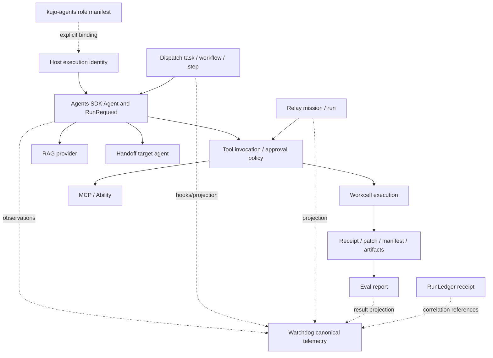
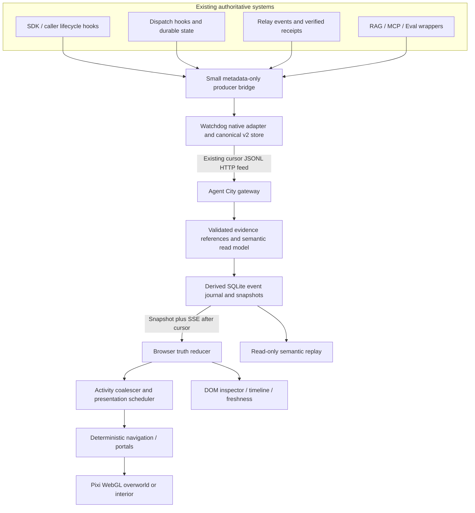
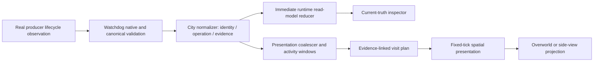

# Kujo Agent City — research and build-ready architecture

Audience: the owner and Phase 1 implementation agent. Date: September 7, 2026. Scope: available Kujo source, supplied five visual references, current upstream rendering documentation, and an implementable Observer Mode. This is architecture research, not a claim that a live city or production integration already exists.

**EXISTS TODAY** identifies inspected code/contracts. **PROPOSED** identifies this design. **FUTURE** identifies explicitly deferred scope. Unless labeled otherwise, design choices and numeric budgets below are proposed. Repository paths resolve against the sibling ecosystem checkouts; immutable source links and source symbols are in [the evidence ledger](evidence.md). All 127 discovered immediate sibling Git repositories are inventoried; selected relevant repositories were inspected in depth, not all 127.

## A. Executive summary

Build a standalone `agent-city` repository containing one local web application, one small observation gateway, a pure TypeScript core, and a rendering boundary. Use **PixiJS 8.20.0 with WebGL**, Tiled-authored maps, a 256×240 logical viewport, 16×16 navigation cells, 16×16 overworld characters, and 16×24 interior characters. Put readable task/evidence information in ordinary DOM beside the canvas. Do not involve Three.js.

Kujo already supplies much of the difficult infrastructure: Agents SDK execution primitives; Dispatch workflows, lifecycle hooks, retries and state; Relay ordered mission evidence; Workcell execution receipts and artifact boundaries; Watchdog canonical telemetry, correlation, immutable-record conflict handling and cursor-based JSONL export; RunLedger cross-system receipt links; Eval results; RAG retrieval; MCP and Ability tool contracts; and a separate `kujo-agents` registry of 85 role packages. These are concrete systems, not interchangeable pieces of one universal agent daemon. [Runtime and telemetry evidence](evidence.md#local-source-ledger).

The decisive gap is **live, correlated lifecycle coverage**. An event enum does not prove the runner emits the event. Some SDK telemetry is assembled only after a run, RAG's inspected trace emitter writes an audit record rather than sending OTLP, and Eval's adapter projects results after evaluation. A truthful city cannot turn these into current activity by guessing. First add a bounded, metadata-only lifecycle observation seam around real operations and feed Watchdog's existing native adapter. Reuse Dispatch's existing hooks and Relay's run history; do not invent another orchestration engine or universal event bus.

The first city should show three to five identifiable execution instances in a tiny neighborhood: Dispatch HQ, Workshop, Library, Meeting Hall and Dojo. Workshop and Library must have working side-view transitions; Meeting Hall and Dojo can share authored room infrastructure but must show activity only when their actual corresponding operations are instrumented. Underground is an optional read-only infrastructure cutaway, not an invented network. Full replay UI, commands and playable avatar wait.

The city owns a **derived read model** and presentation state. Runtime producers own task/run truth. Watchdog owns the consolidated observation journal. Every significant visual action retains evidence IDs, actual timestamps, completeness and freshness. A completed 300 ms query shown in a two-second visit says “recent retrieval”; the inspector says “completed.” No runtime ever waits for a sprite.

## B. Kujo ecosystem capability map

“Yes” means a source implementation was found, not deployed or proven complete for Agent City. “Partial” describes observation coverage. Artifact-only tools are integrated through their runner's bounded operation envelope; the browser does not poll each CLI.

| Capability | Kujo repo/system | Existing? | Reusable? | Agent City role | Gap / boundary |
|---|---|---|---|---|---|
| Language/runtime | `kujo` | Yes | Yes | Run native producers and validation tools | Not the browser render loop |
| Agent execution | `agents-sdk` | Yes | Yes | Runs, tools, handoffs, retrieval and policy | Add actual live lifecycle sink; enum alone insufficient |
| Role definitions | `kujo-agents` | Yes, 85 registry entries | Yes | Profile IDs, names, capability hints | Static roles are not live people or execution instances |
| Provider primitives | `ai-sdk` | Yes | Yes | Existing model/embedding access | No direct browser model client |
| Workflow orchestration | `dispatch` | Yes | Yes | Tasks, step assignments, retries, lifecycle hooks | Bind workflow step to explicit execution identity; trace is bounded |
| Mission evidence | `relay` | Yes | Yes | Ordered run events, receipts, export/verify, watch | Some details arrive after execution; no universal presence |
| Execution isolation | `workcell` | Yes | Yes | Workshop execution environment, artifacts, receipt | Workcell ID is not agent identity; Box proposal is not shipping runtime |
| Web workspace | `workcell-studio` | Yes | Selectively | Inspect/run/eval/evidence service pattern | Do not reuse its application session as universal agent identity |
| Canonical observation store | `watchdog` | Yes | Primary | Metadata, traces, native adapter, canonical feed | Complete lifecycle coverage, source epoch/gap contract needed |
| Receipt history | `runledger` | Yes | Yes | Archive and run links | Not full micro-event history or authoritative execution status |
| Evaluation | `eval` | Yes | Yes | Dojo scores, checks and terminal outcomes | Existing Watchdog projection is result-based; start hook needed |
| Task contracts | `spec` | Yes | Yes | Build contract and inspection reference | No always-on task authority inferred |
| Retrieval | `rag` | Yes | Yes | Library requests, namespaces, source citations | Caller observation seam; trace audit is not a live event stream |
| Tool protocol | `mcp` | Yes | Yes | Terminal server/tool identities | Distinguish transport RPC from agent task lifecycle |
| Portable capability | `ability` | Yes | Yes | Tool descriptors, policy, receipt references | Reuse enforcement, not just display hints |
| Remote capability gateway | `ability-gateway` | Controlled beta | Later | Subject-scoped terminal connections | Seeded execution fixtures are not arbitrary backend adapters |
| Ability-MCP bridge | `ability-mcp` | No sibling repo found | In `ability`/`mcp` surfaces | Existing projection/bridge capabilities | Do not create a duplicate based on a guessed repo name |
| Search evidence | `searchbridge` | Yes | Later | Library external research station | Carries normalized search/analytics evidence; not universal web research |
| Chat & saved execution | `ai-chat` | Yes | Later | Deep links, user interaction, execution receipt integration | Journal is app-scoped; raw stream contains content, filter it |
| Approval/mobile presence | `leash` | Yes | Later | Pending decision and session status | tmux detection is lower-confidence observation, not task authority |
| Release readiness | `shipcheck` | Yes | Yes | Dojo/shipyard gate result | Passing gate does not prove publication |
| Package distribution | `kennel` | Yes | Later | Depot package fetch/verification | A repository/package is not an agent |
| Change footprint | `changebucket` | Yes | Tool output | Inspection bench metric | No invented progress or evaluation verdict |
| Failure evidence | `casefile` | Yes | Yes when needed | Archive failure bundle link | Do not copy raw failures/log content into world feed |
| Context packaging | `scent` | Yes | Tool output | Context package artifact | Creating a pack does not imply delivery to another agent |
| Architecture gates | `fence` | Yes | Yes | CI dependency boundaries; Dojo result | Not a simulation/ECS library |
| Quiet workflow execution | `muzzle` | Yes | Selectively | Run validation with retained logs | Not event compression for sprites |
| Example publication | `howl` | Yes | Later | Verified launch/demo material | Not game rendering or live telemetry |
| Browser evidence | `lens` | Yes | Yes | Visual inspection and interaction evidence | Can wrap Playwright; avoid duplicate gates |
| UI design system | `site-kit` | Yes | Selectively | Vendored DOM tokens/components/fonts | Source-driven dist, not published React runtime |
| Static publishing | `ssg` | Yes | Optional docs | Public documentation later | Cannot substitute for live gateway |
| Workflow handoff checks | `concord`, `packwrite`, `patchbrief` | Yes | Development only | Contract drift/context when useful | No dedicated building per tool required |
| Knowledge ingest | `totalrecall` | Yes | Later | Library provenance links | Imported artifacts are not live meetings |
| Review/critique | `tribunal` | Repo discovered | Future, inspect before adapter | Possible Dojo review room | Not certified as an Agent City integration here |
| Memory | Strata, existing RAG/memory hosts | Separate systems | Links only initially | Memory shelf when source type explicit | Do not infer memory reads from any document retrieval |

The map uses [source implementations and documented boundaries](evidence.md#local-source-ledger). Deep runtime coverage concentrates on Agents SDK, Dispatch, Relay, Workcell, Watchdog, RunLedger, RAG, Eval and AI Chat. Secondary tools were reviewed for contracts/ownership, not comprehensively audited.

## C. Current agent runtime model

There is no single shared “Kujo Agent” table that owns every runtime. The SDK's `Agent` is a configuration object with tools/policy and a run execution relationship. Its `role` is a chat-protocol role, not “architect” or “researcher.” Occupational metadata comes from `kujo-agents` manifests or explicit application configuration. SDK results, Dispatch tasks, Relay missions, Workcell executions and AI Chat executions each have their own IDs and lifetimes. Namespace them; never join by display name. [Exact symbols](evidence.md#runtime-model-details).



The arrows describe available integration relationships, not a claim that every Dispatch task currently runs through Relay or every SDK tool uses Workcell.

| Entity | Actual ownership and meaning | Stable enough for city? |
|---|---|---|
| Agent profile | Static role manifest/catalog; SDK configuration has ID/name/instructions/policy/tools | Explicit profile key stable; generated/default IDs need host binding |
| Execution instance | Host-created run/worker with source namespace and lifetime | Yes within that lifetime; preserve separate instances of same role |
| Task | Dispatch durable task/workflow input/state; other hosts own their own tasks | Source-qualified task ID; not a sprite |
| Run | SDK run request/result; Dispatch workflow execution; Relay evidence run; AI Chat execution | Source-qualified ID plus parent/causal links |
| Workcell | Bounded command execution/environment, checkout and artifact receipt | Stable execution ref; workshop station, not persona/home ownership |
| Tool | SDK registered tool invocation; MCP request/call; Ability descriptor/execution | Invocation ID plus attempt; tool name alone cannot deduplicate |
| RAG | SDK retrieval provider or RAG API request, namespace and results/citations | Query operation key required; source shelf only when metadata present |
| Message | SDK model conversation messages are not necessarily agent-to-agent messages | Show exchange only with explicit sender/recipient/correlation |
| Handoff | SDK handoff target and source; workflow/mission transitions elsewhere | Real delegation can be represented without inventing conversation |
| Artifact | Source-owned output/manifest/receipt reference | Yes; inspect by authorized locator, hash and status |
| Eval | Suite/check results; result projector with correlated run | Terminal check truth exists; start/progress coverage separate |
| Release | Actual publisher/CI result plus immutable version/digest | ShipCheck pass alone is insufficient; publisher adapter is future |

Persistent persona is optional. Proposed key: `workspaceNamespace + profileId + configuredPersonaId`; execution key: `producer + sessionId + runId + workerId`. If the host provides no persistent persona, display an ephemeral worker and retire it on terminal lifecycle. Never create “Fred” persistence by equating unrelated runs named Fred. Concurrent runs of a persona render separate numbered instances, sharing appearance with an instance badge. Names and sprites never become authorization identifiers.

Parent/child relations require explicit source references. Capabilities and assigned tools derive from the executed configuration, not only a role's recommended tools. Task queues, retries, approvals, failures and artifacts stay under their producer's rules. Presence has `online`, `offline`, `unknown` and `stale`; silence means stale/unknown, not sleeping or successful. Existing saved sessions or role catalogs do not establish that a worker is online.

## D. Recommended system architecture



**Reuse the Watchdog feed.** `GET /telemetry/v2/jsonl` already exports canonical records ordered by database sequence with signed cursor, record count, hash and manifest headers. It is a finite HTTP page, not an already-existing push subscription. One gateway reads it, initially at 250 ms while active and backing off toward 2 seconds idle. Multiple clients share that reader. Read following pages immediately under bounded work/IO budgets while catching up. No browser polling of each backend. [Export implementation](evidence.md#watchdog-feed-and-correctness).

The bridge adds only missing producer normalization and bounded spool consumption. Native Watchdog normalization code lives in Kujo; invoke/reuse that module rather than reimplementing its hashing rules in TypeScript. Persist the canonical batch once and retry identical serialized bytes. The gateway is a TypeScript HTTP process that consumes approved canonical data; it must not bypass Watchdog auth, read Watchdog SQLite directly, execute tools, or own model credentials.

The gateway's SQLite is explicitly a **rebuildable materialized projection**: accepted redacted semantic events, source cursor, snapshots, version metadata, and normalized dedup keys. It is not a second canonical telemetry store. It permits atomic snapshot/cursor handoff and bounded browser replay without storing prompts, results or full logs again. For durable replay beyond Watchdog retention, pin a source export in an evidence archive with a manifest, then retain the derived package's provenance pointer. RunLedger links it; RunLedger's schema need not become an event log.

Start as one locally bound gateway serving the built frontend and API on the same origin. Use an authenticated same-origin session for remote access; deployment remains Phase 2. Browser clients see only authorized workspace data, even though the existing Watchdog feed can expose all records to its API-token holder. Server applies the workspace binding/allowlist before emitting. A source having no unambiguous workspace binding is quarantined, not sent globally. Never expose Watchdog credentials to EventSource URLs.

Backend owners remain authoritative for business state. Watchdog is the cleanest **consolidated authoritative observation journal**, not authoritative orchestration. Conflict resolution is source-specific: e.g. Dispatch terminal state outranks a derived heuristic dashboard outcome; a model span `ok` cannot complete its parent task. Source snapshots reconcile unknown/late/gapped observations. Snapshot adapters are gateway plugins invoked on startup, explicit recovery or slow reconciliation, not client-to-every-service polling.

## E. Rendering technology decision

Current checked upstream documentation lists PixiJS 8.20.0 stable and Phaser 4.2.1 (July 9, 2026). Treat version pins as the evaluated baseline and validate the lockfile when implementing. [Pixi versions](https://pixijs.com/versions), [Phaser releases](https://phaser.io/download/phaser4).

The following ratings are project-specific judgments, not benchmark measurements.

| Criteria | Phaser 4 | PixiJS 8 | Three.js | Canvas 2D |
|---|---|---|---|---|
| Pixel art | Excellent configuration | Excellent configuration | Extra camera/material discipline | Straightforward |
| Tilemaps / Tiled | Built-in game support | Small build-time map compiler | Custom quad/mesh layer | Custom drawing/compiler |
| Top-down and side view | Scenes/controllers available | Shared containers, explicit controller adapters | Technically possible, unnecessary 3D | Own scene infrastructure |
| Sprite animation | Integrated | Sheets + small deterministic frame selector | More machinery | Manual frame selection |
| Runtime surface | Broad game framework | Rendering-focused | 3D-oriented | Zero engine library |
| WebGL | Yes | Production recommendation | WebGL2 | No |
| WebGPU | Not a requirement here | Available; docs caution production use | Available; separate material pipeline | No |
| GLSL/effects | Version-specific filters/pipelines | Filters, easy single-pass cap | Powerful but excess complexity | No native GLSL |
| Navigation | Semantic graph still needed | Small TS graph | Same need | Same need |
| Determinism | Keep outside engine clock | Natural pure-core boundary | Isolate engine clock | Pure core works |
| Mobile / maintenance | Viable, measure framework footprint | Best balance for this scope | Added GPU/maintenance surface | Viable MVP, more rendering maintenance |
| Fit | Strong second choice | **Choose** | Reject | Tiny rendering POC alternative |

Phaser's scenes, cameras and tilemap API are strong if this becomes a platforming game, but Agent City needs authored graph navigation and external semantic state regardless. Pixi keeps those requirements explicit without adopting game physics. Three's WebGL renderer requires WebGL2; its WebGPU renderer has a different node/material path. There is no need for 3D geometry, perspective, shadows or shared Three/Pixi contexts. [Phaser scenes](https://docs.phaser.io/phaser/concepts/scenes), [cameras](https://docs.phaser.io/phaser/concepts/cameras), [tilemaps](https://docs.phaser.io/api-documentation/function/tilemaps), [Three renderer](https://threejs.org/docs/pages/WebGLRenderer.html), [Three WebGPU](https://threejs.org/manual/en/webgpurenderer).

Explicitly choose WebGL in Pixi. Current Pixi docs recommend it for production and describe Canvas fallback as coming soon. If GPU initialization fails, keep the DOM roster/timeline usable; do not promise an automatic Canvas renderer. Raw WebGL/WebGPU would trade away useful batching/texture management for no demonstrated gain. No hybrid renderer. [Pixi renderers](https://pixijs.com/8.x/guides/components/renderers).

No comparative gzip-size or FPS claims were measured. Phase 0 measures the actual production bundle, atlas uploads, frame costs and memory. Canvas optimization guidance supports integer coordinates and cached reusable drawing, but does not establish a universal maximum agent count. [Canvas optimization](https://developer.mozilla.org/en-US/docs/Web/API/Canvas_API/Tutorial/Optimizing_canvas).

## F. World model and visual constraints

The two views share semantic identity and evidence, not sprite coordinates. A semantic agent can have an active operation at the Library while its presentation is still crossing a street. Name the fields so that this cannot be mistaken for physical runtime truth.

```typescript
type Ref = { namespace: string; kind: string; id: string };
type RenderMode = 'overworld' | 'side';
type Activity = 'work' | 'retrieve' | 'tool' | 'handoff' | 'evaluate' | 'wait';
interface AgentIdentity {
  instanceId: string; profileId?: string; personaId?: string;
  displayName: string; appearanceId: string; parentInstanceId?: string;
  source: Ref; roleLabel?: string;
}
interface RuntimeAgentView {
  identity: AgentIdentity; task?: Ref; run?: Ref; workcell?: Ref;
  presence: 'online' | 'offline' | 'unknown' | 'stale';
  operations: Record<string, { activity: Activity; phase: string; evidence: string[] }>;
  lastObservedAt: string; completeness: 'complete' | 'partial' | 'unknown';
}
interface SemanticLocation {
  id: string; districtId: string; zoneId: string; buildingId?: string;
  roomId?: string; capability: string; stationId?: string;
}
interface Portal {
  id: string; fromScene: string; fromNode: string;
  toScene: string; toNode: string; reciprocalId: string;
}
interface WorldDefinition {
  version: string; hash: string;
  districts: { id: string; zoneIds: string[] }[];
  zones: { id: string; buildingIds: string[] }[];
  buildings: { id: string; entrancePortalId: string; roomIds: string[] }[];
  locations: SemanticLocation[]; portals: Portal[];
  scenes: { id: string; mode: RenderMode; mapHash: string; navGraphId: string }[];
  props: { id: string; sceneId: string; inspectRef?: Ref }[];
  interactions: { id: string; locationId: string; nodeId: string; activity: Activity }[];
}
interface PresentationAgent {
  instanceId: string; sceneId: string; locationId: string;
  destinationId?: string; routeNodeIds: string[]; edgeProgressFixed: number;
  animation: string; tick: number; evidenceIds: string[];
  mode: 'live' | 'recent' | 'replay'; // describes presentation, not execution
}
```

Operational metadata is optional and remains unknown when absent. Building occupancy distinguishes displayed occupants, current runtime activity count, and recent activity count. Do not add these together or label all as active.

**Reference analysis:** Photo 1 supplies useful organization/selection/inspector hierarchy, but its crowded fixed desktop framing and turtle-like portraits are not assets to reuse. Photo 2 establishes compact streets, distinct facades, water barriers, bridges and manholes; its nine-building density is a later city, not the MVP. Photo 3 is the strongest mandatory side-view reference: horizontal floors, doorways, stairs and stations. Photo 4 supplies a group interaction composition, but a rendered conversation requires actual messages, not generated flavor text. Photo 5 supplies source departments, shelves and a selected retrieval inspector, while its room is more frontal/top-down than a strict side-view platform space. Adapt Library to Photo 3's floor grammar. All five references are visually richer and text-denser than a literal NES frame. Do not trace maps, copy sprites, portraits, UI text, logos, music or turtle silhouettes. Use original Kujo character silhouettes and separately approved branding.

**Proposed viewport:** 256×240, comprising 256×208 world and 32-pixel HUD. An 8×8 art grid builds 16×16 collision/navigation metatiles. Initial neighborhood 32×24 metatiles (512×384 logical pixels), about four camera-sized regions. Use finite orthogonal maps. HUD: selected agent short name/icon, source freshness, live/recent/replay marker and alert count. Detailed text belongs in DOM, not a 40-column miniature dashboard. Remove score/lives/HP from the references; counts mean real things only.

Scale with nearest-neighbor sampling and integer camera coordinates. Choose an integer device-pixel scale that fits available space; align the canvas to device pixels, derive CSS dimensions from devicePixelRatio, and letterbox. Do not inflate the internal scene to full retina dimensions. At ordinary DPR=1/2 this corresponds to integer CSS scaling; fractional DPR needs device-pixel snapping. On small screens show canvas above inspector with a 1× minimum and scrolling if necessary. Test 320 px width, orientation and browser zoom; allow a user-selectable larger accessible DOM-only view.

Hardware reference, not a literal emulator mandate: the NES picture is 256×240 with 8×8 patterns and 8×8/8×16 hardware sprites. A 16×24 character is a composite, not one NES hardware sprite. This project adopts the spatial grammar but does not emulate sprite flicker, scanline limits or palette register writes. [NESdev PPU rendering](https://www.nesdev.org/wiki/PPU_rendering), [programmer reference](https://www.nesdev.org/wiki/PPU_programmer_reference), [palette documentation](https://www.nesdev.org/wiki/PPU_palettes). NESdev is specialist hardware documentation, not Nintendo first-party material.

## G. Event model and time semantics

Use a small semantic protocol, but **do not make `world.agent.travel` backend truth**. Normalize domain observations to `operation.started`, `operation.finished`, `execution.observed`, `relationship.observed`, `artifact.observed`, `source.gap` and `source.reconciled`. The browser planner derives travel/enter/work/leave commands. These commands retain evidence and are not sent back to Kujo. [Full protocol, ownership and examples](protocol.md).



This improves the suggested “animation plan then world state” chain: runtime state updates before animation, never after it. There are three clocks: producer occurrence time, gateway observation/order, and presentation ticks. Arrival sequence defines reproducible ingestion order; it is not proof of cross-host causal order. Explicit causal/parent references take precedence when presenting relationships. Clock skew is shown, not corrected with invented timestamps.

A source operation completes immediately in the truth reducer. A visit can continue briefly only as **recent activity**, with actual start/end timestamps. No progress bar percentage unless the source supplies a meaningful denominator. Spinning/reading is an indeterminate status animation, not fake query progress.

Aggregation key: execution instance + run + capability + source department + activity class. Proposed quiet merge window 750 ms, maximum continuous display window 5 seconds, at most one pending routine visit per capability and six routine plans per agent. Fifteen retrieval calls in four seconds become one Library visit with a 15-call count, per-outcome totals and evidence list pagination. Related terminal calls stay in one terminal session. Counts include retries separately while logical operation counts group attempts. Preserve failed/skipped/canceled distinctions.

A maximum presentation lag of 3 seconds triggers collapsing obsolete intermediate routes to a labeled recent-activity summary and current destination. Never walk faster forever to repay backlog. Completion/failure/approval observations update UI immediately. Failure or approval interrupts routine visits on the next simulation tick; doors/interior transitions resolve to the nearest deterministic safe node or cut directly with an explicit transition. Do not invent a long return journey when another operation is already active.

Concurrent operations remain a set in runtime truth. One sprite cannot physically occupy all of them. Select display priority: failed/approval-blocked, then user-followed operation, then newest active foreground operation, with stable operation-ID tie break. Other concurrent operations appear as a count/stations in the inspector. Independent work by child agents gets distinct instances; parallel tool calls by one agent do not clone agents.

## H. Event-to-world mapping

The source column is deliberately specific about observed versus proposed instrumentation. A named activity is not automatically an existing emitted event.

| Kujo activity / source evidence | Location | View | Animation | Visual artifact and truth condition |
|---|---|---|---|---|
| Dispatch task/step start hook | HQ → assigned Workshop | Top-down → side | Walk, work | Task board entry; resolve configured step owner |
| SDK run start, after live sink added | Workshop | Side | Work | Run badge; default role remains unknown |
| SDK retrieval provider call, new wrapper start/end | Library department | Side | Read | Document token; source/namespace only if explicit |
| RAG completed result/audit stage | Library | Side or overlay | Brief inspect | “Recent retrieval”; never current start inferred |
| SearchBridge completed search evidence | Library external research station | Side | Read | Source evidence ref and measured result count |
| SDK tool invocation live envelope | Workshop tool bench | Side | Terminal/work | Invocation+attempt; unspecified tool stays generic |
| Explicit MCP tool RPC | Terminal Center, later | Side | Terminal | Server/tool icon; one chosen logical observation per call |
| Ability approval pending | Terminal / current station | Side | Wait | Lock indicator linked to actual approval ID |
| SDK handoff source and target | Meeting Hall or source doorway | Side | Talk/carry | Handoff package; does not imply synchronous meeting |
| Explicit message sent/received | Sender station → recipient inbox | Either | Talk/inspect | Packet; receipt confirmed only by delivery/receive event |
| Scent context pack created | Workshop/Archive | Side | Carry | Pack ref; no delivery animation until actual transfer |
| Workcell execution started, new wrapper | Workshop execution bay | Side | Work | Cell/run label; no agent duplication |
| Workcell receipt/artifact completed | Workshop → evidence shelf | Side | Inspect/carry | Receipt/manifest hash; execution and integrity separate |
| Eval start, new wrapper | Dojo | Side | Inspect | Activate authored check stations, no combat |
| Eval suite/check result projector | Dojo | Side | Inspect/blocked | Clear/block corresponding known check; show skipped separately |
| Spec/Fence/ChangeBucket check result | Dojo bench | Side | Inspect | Contract/footprint result, not generic release approval |
| ShipCheck gate pass | Shipyard inspection, later | Side | Inspect | Gate stamp only; vessel remains docked |
| Publisher confirmed release | Shipyard, later | Side | Carry/acknowledge | Departing package keyed to published version/digest |
| Kennel package fetch/verify | Depot, later | Side | Carry/inspect | Package version and verification status |
| Watchdog service error | Relevant station + Watchtower later | Either | Alert | Persistent incident indicator; clear only on matching recovery |
| Explicit task blocked | Current station | Side | Wait/blocked | Reason code and source; no random obstacles |
| Tool retry scheduled | Current station | Side | Wait | Attempt count/backoff; prior error stays in history |
| Source disconnected/stale | HUD and source-associated entities | Either | Frozen/unknown cue | No “all agents offline” inference |
| RunLedger finished receipt | Archive, later | Side | Inspect | Human verdict shown separately from runtime status |
| Transport queue metrics, if instrumented | Underground cutaway | Side | Meter/packet | Counts/flow only for measured queue and links |
| Explicit presence offline | Home/last confirmed location | Either | Offline pose | Never inferred simply from silence |

Spatially moving two agents into a meeting for one asynchronous message would misstate collaboration and disrupt actual tasks. Default to a packet/inbox metaphor at their current stations. Reserve co-location for a source-defined consultation/session or user-selected replay of a real handoff. No generated dialogue masquerades as an observed message.

## I. City blueprint

The MVP uses one ring street, two short cross paths, one canal edge and five facades. The archive is initially a Workshop evidence shelf and infrastructure is a single optional cutaway reached from one manhole. Shared HQ/Meeting courtyard reduces travel without adding a giant map.

```text
512 × 384 logical world / 32 × 24 metatiles
┌────────────────────────────────────────────────────┐
│ Canal / black water boundary     bridge (closed map)│
│                                                    │
│  LIBRARY             DISPATCH HQ        DOJO        │
│  shelves/terminal    task board         checks      │
│      D                   D                D        │
│══════╪═══════════════════╪════════════════╪═══════   │
│      │           quiet central court     │         │
│      │                 M                 │         │
│      └────D────────────────────D─────────┘         │
│       WORKSHOP              MEETING HALL           │
│       bench / Workcell /    handoff station        │
│       evidence shelf                               │
│       M → optional infrastructure cutaway          │
└────────────────────────────────────────────────────┘
D = reciprocal side-view portal; M = manhole
```

Compiler authors exact coordinates; the conceptual sketch is not a copyrighted map and is not a collision specification. Phase 1's build contract requires portal reachability and station coordinates in its authored fixture. All five buildings support side view; Library and Workshop are mandatory first. The two-level Library uses one ladder and two shelf stations. Dojo uses three check stations, not enemies. Workshop uses a workbench and evidence cabinet. HQ uses a task board. Meeting Hall uses two to five station slots around a side-view table. Each initial room fits 256×208, with one reusable two-floor template where needed.

Underground maps infrastructure **only when measured**: ingress spool, Watchdog ingestion, canonical journal, City projection, browser connection. Kujo isn't proven to run a distributed sewer-like message network. Draw logical stages of this actual pipeline; a dropped observation is a visible broken sensor/coverage alert, not a task failure. No packets with fabricated delivery success. Build this after the primary seam is working; otherwise show an explanatory inactive entrance.

## J. Scene model, camera and navigation

One `WorldDefinition`, one truth store, one presentation store, one active camera. Pixi containers/assets are disposable views. `OverworldView` and `InteriorView` share sprite appearance lookup, world refs, selection, inspectors and fixed-tick scheduling. No duplicate agent objects in scene-local business state.

Overworld controller follows a small authored street graph with four-direction movement. Run A* only when destination changes, deterministic neighbor order and tie break `(f,g,nodeId)`, integer costs; cache routes by map hash/from/to. Use BFS if all edges are equal. Collision validates against 16×16 cells. No crowd physics: authored lane offsets and stable station slot assignment; cap visible crowd and aggregate occupancy. Route reservation and dynamic replanning wait unless fixtures demonstrate doorway starvation.

Interior controller traverses nodes/edges typed `walk`, `ladder`, `stairs`, `portal`. Stairs and platforms are authored paths with fixed integer-tick motion, not gravity/jump simulation. An agent reaches an interaction node, faces its station, then displays its activity frame. Interaction slot contention changes only visual placement; it never blocks runtime work. Show overflow as a count with selectable instances.

Portal transition: reach entrance node → brief black wipe (100–150 ms) → transfer presentation scene/location atomically → establish matching interior node → resume visit. Cache current room and at most two recent interiors; deterministic content loaded by map hash. If asset loading fails, truth remains inspectable and portal shows unavailable art; do not lose agent identity. Preload first two mandatory rooms, lazy-load remaining rooms. Asset cache eviction is not semantic state.

Observer camera stays city-wide and does not cut for every agent. Clicking a facade selects its room/inspector. Follow locks one instance and crosses portals with it; concurrent operations are summarized rather than camera thrash. If followed instance ends, keep the final state/timeline and offer a related instance; do not silently follow a same-named worker. User pan temporarily suspends camera lock; explicit resume restores it.

After a completed visit, next pending meaningful activity wins. Otherwise return to assigned workspace only if a real active task remains; completed execution stays in a neutral completed pose briefly and then retires. Offline/sleep requires explicit presence. This avoids endless fake patrols between completed tasks.

Core uses 20 Hz fixed ticks, integer/fixed-point route progress and stable iteration. Renderer uses requestAnimationFrame and snapped interpolated coordinates. Animation frames change at 6–8 fps. When tab hides, stop rendering; when visible again request delta/snapshot and collapse obsolete plans. Never simulate hours of catch-up ticks. [Fixed timestep engineering](https://gafferongames.com/post/fix_your_timestep/) supports bounded fixed updates; cross-browser determinism still requires our integer/pinned-input discipline.

## K. Agent sprite and asset system

Overworld 16×16; side-view artwork 16×24 inside 16×32 atlas cells, feet anchored at a declared consistent baseline. Four overworld directions; left/right interiors plus a ladder pose. A role's base/head/clothing/accessory/accent layers share direction and frame anchors. Shape, accessory and role glyph supplement color. No ninja-turtle silhouette or reference portrait extraction.

| Semantic animation | Required unique frames | Reuse |
|---|---:|---|
| idle | 1 per direction | All neutral states |
| walk | 2–3 per direction | Route travel |
| work/read/terminal/talk/inspect | 2 per needed side direction | Shared body motion + role-specific prop |
| wait | 1 | Idle + pending icon |
| blocked/alert | 2 | Overlay indicator, reduced motion static |
| carry | 0 new body frames | Walk + packet prop |
| ladder | 2 | Side-view movement only |
| complete acknowledgment | 2 | Short evidence-backed confirmation |
| offline | 1 | Explicit presence only |

Precompose only the three to five named MVP appearances at **build time**. Avoid runtime multi-layer draw calls for every agent and avoid prebuilding all clothing combinations. Later compose once per appearance hash into a cache. Changing scene chooses a different animation set under the same appearance ID. Missing animation falls back to idle plus a truthful icon, never a blank or different identity.

Use Aseprite sources and batch CLI PNG+JSON export; pin the tool version, layer/tag order, padding/extrusion and atlas metadata. Names: `agents/<appearance>/<overworld|side>/<animation>-<direction>/<frame>`. `appearance.json` names layer selection, palette, atlas hash, feet anchor, allowed animation tags and fallback. Frame timing in integer presentation ticks, not arbitrary texture animation timers. [Aseprite CLI](https://www.aseprite.org/docs/cli/).

Maps: Tiled finite orthogonal JSON with tile layers `ground`, `walls`, `background`, `foreground`, `effects`; typed object layers `Portal`, `NavNode`, `NavEdge`, `InteractionPoint`, `Region`, `InspectTarget`. Properties hold semantic location IDs, paired portal IDs, station capability, facing and traversal cost. No runtime agent IDs in map files. Compile to an engine-neutral map; reject unknown critical properties, unresolved external tilesets, unsupported rotations, invalid GIDs, duplicate IDs, unreachable stations or nonreciprocal portals. Handle supported Tiled flip flags explicitly; never treat flagged GIDs as raw atlas indices. [Tiled JSON](https://github.com/mapeditor/tiled/blob/master/docs/reference/json-map-format.rst), [custom properties](https://doc.mapeditor.org/en/stable/manual/custom-properties/).

LDtk is a viable structured levels/entities alternative. Choose one authoring format now; implementing a second importer adds contract surface without solving the MVP. [LDtk JSON](https://ldtk.io/json/). No skeletal animation package, physics editor or paid atlas service needed. Aseprite licensing/tool availability may be handled by accepting artists' exported PNG+JSON and using a separate CI validation path; do not make runtime depend on the editor.

Reproducible pipeline: original source assets → batch export → palette/frame/anchor validation → atlas/map compile → sorted manifest with SHA-256 → hashed filenames → CI clean rebuild comparison. Each asset manifest records creator/source/license or permission. Reference images are research inputs, excluded from runtime/repository asset distribution. Props, signs, sound and maps need the same provenance. Use optional single-pass CRT scanlines later, never per-agent filters; curvature must not distort inspector text. Water is a two-frame tile. Weather/day-night is explicitly ambient if added, disabled by default, unrelated to health. Audio starts muted and only after user gesture; debounce real failure/complete cues, preserve reduced-motion preference. [Web Audio best practices](https://developer.mozilla.org/en-US/docs/Web/API/Web_Audio_API/Best_practices).

## L. MVP specification

The executable specification is [Phase 1](phase-1.md). The minimum useful proof is a **real SDK run with an offline deterministic model callback and actual local RAG retrieval**, carried inside a real Dispatch workflow or correlated host task. This is real runtime/tool activity without requiring paid model access. It must be labeled offline model fixture, not live AI reasoning. Add a second optional model-provider run only after the deterministic integration works.

First prove one agent end-to-end before expanding to three to five: actual run and retrieval starts/ends → Watchdog native/canonical records → one gateway cursor reader → browser semantic reducer → top-down Library travel → side-view read → immediate current status inspection → task result/evidence shelf. No injected fake `world.travel` messages as the acceptance evidence. Synthetic traffic remains valid for unit/stress tests and is visibly labeled in demos.

One real handoff and one real Eval result validate Meeting Hall and Dojo. If a check finishes before the camera arrives, mark it recent. A failure path must show a real check failing, a subsequent real check passing, and both attempts retained. UI cannot author a passing verdict. Shipyard publication is not required in MVP.

## M. Phased roadmap

| Phase | Deliverable | Exit gate |
|---|---|---|
| 0 · seam and renderer proof | Source lifecycle contract, exact dependency pins, minimal static room, no full product | Real start before completion, canonical retry dedup, disconnected client recovery; measure bundle and pixel scale |
| 1 · Observer MVP | Tiny block, 3–5 instances, Workshop/Library mandatory, HQ/Meeting/Dojo, inspect/follow | Acceptance corpus and integration trace in phase-1.md; no unexplained travel |
| 2 · capability coverage | MCP center, archive, Watchtower, depot/shipyard, source health and optional underground | Each adapter has authority, correlation, redaction and coverage fixtures; deployment isolation reviewed |
| 3 · replay/debugging UI | Timeline scrub, seek/checkpoint, evidence diff, recorded source package import | Repeated semantic state hashes match pinned versions; coverage gaps visible |
| 4 · Director | Legitimate assign/stop/review/open operations through existing owner APIs | Explicit source capability/auth/idempotency/approval and reconciliation; commands never succeed by animation |
| 5 · Player | Optional controllable avatar, touch/controller, contextual actions | Adds value in user trial and uses same authorized commands/inspectors |

Minimal replay foundations are Phase 1: deterministic reducers, versioned journal and replay tests. Deferring replay UI must not defer the data needed to replay. Phase 0 implementation spikes are separate from this completed research pack; no POC was necessary to make the recommendation.

## N. Repository, packages and Kujo-native workflow

Choose a standalone **`kujolang/agent-city`** repository, initially local-first. Reusable source packages + one application, with no npm publication requirement. Embedding in AI Chat would inherit its provider/session/UI lifecycle and its unrelated dependencies; the city must also observe Dispatch and Relay without chat. A link/embed integration can be added later. Workcell Studio is a service-pattern reference, not the product home.

```text
agent-city/
  research/                  this pack; immutable evidence baseline
  apps/web/                  Vite + DOM inspectors + Pixi composition root
  apps/gateway/              Node HTTP/SSE, Watchdog reader, auth, derived SQLite
  packages/protocol/         JSON Schema + generated TS types, version migrations
  packages/world-core/       truth reducer, coalescer, scheduler, graph navigation
  packages/renderer-pixi/    view containers, textures, input hit testing, camera
  integrations/kujo/         Kujo native adapter reuse, source mapping manifests
  assets/source/             original editable maps/sprites and licenses
  assets/compiled/           validated hashed map/atlas manifests
  scripts/                   asset compile, contract and evidence verification
  tests/fixtures/            sanitized real traces plus synthetic adversarial cases
```

Use npm workspaces and one package-lock, consistent with inspected browser apps, Vite/TypeScript strict mode, Vitest for pure contracts, Playwright for real browser interactions, and a small Node HTTP service. Avoid Express if built-in HTTP suffices for four read endpoints. Select a currently supported Node LTS satisfying Vite and SQLite choice at implementation; local research environment is Node 24.20.0. `better-sqlite3` is already used in AI Chat and is a reasonable pinned gateway option; validate native-module startup on supported hosts. Do not claim the research pack has installed or benchmarked these proposed dependencies.

No ECS initially: a record keyed by instance ID plus pure systems is enough. Renderer owns GPU types, textures, filter code, hit tests and camera display. Core owns IDs, semantic state, activity windows, deterministic routes and ticks. Adapter owns producer schema decoding/correlation; protocol owns no rendering types. Fence should reject imports from world-core to Pixi, DOM, server IO or producer-specific repos.

Vite supplies a vanilla TypeScript entry point and production bundling; Vitest fits pure core tests. Playwright screenshot baselines require a fixed browser/platform because rendering differences are expected across environments. Use current official setup constraints when locking the toolchain. [Vite guide](https://vite.dev/guide/), [Vitest guide](https://vitest.dev/guide/), [Playwright visual comparisons](https://playwright.dev/docs/test-snapshots).

Dogfood deliberately: Spec captures acceptance; Loop Engineering can run bounded implementation iterations; Eval checks deterministic fixture outputs; ShipCheck coordinates release gates; Watchdog measures the adapter/gateway without recursive self-ingestion (exclude Agent City instrumentation producer); RunLedger records implementation receipts and links trace packages; Workcell bounds test execution when practical. Use Scent for narrow source handoff, CaseFile only for failures, Muzzle to keep test output compact, Lens/Playwright for a single browser-evidence path, Howl for later verified examples. Do not force Kennel to manage npm dependencies or Leash to authorize local read-only observing. These tools do not each need a process or a building in Phase 1.

## O. Risk register and performance plan

| Risk | Rank | Evidence / consequence | Mitigation and gate |
|---|---|---|---|
| Enum mistaken for live event coverage | CRITICAL | SDK source does not emit all named tool events; post-run projection cannot show current work | Live sink test must observe start before controlled tool resolves |
| Missing/ambiguous identity | HIGH | Different runtime IDs/roles; same name may be many instances | Namespaced explicit host mapping; unknown bucket, no guessed joins |
| Mutable starts under immutable event ID | HIGH | Watchdog rejects conflicting record identity | Separate start/end record IDs, shared operation ID; identical retries |
| Cursor restore/retention gaps | HIGH | Signed sequence is not an epoch or complete retention proof | Source epoch/min-retained-cursor extension or conservative manual reset; freeze truth as unknown |
| Presentation lies after completion | HIGH | Queries can finish before walking completes | Immediate truth reducer, recent label, 3-second lag collapse |
| Cross-host timing/cause confusion | HIGH | Timestamps cannot establish global causal order | Preserve arrival sequence and explicit causal refs; annotate skew |
| Content disclosure | HIGH | Tool results/chat/RAG contain private data | Metadata allowlist before persistence; scoped evidence resolution; never raw content SSE |
| Replay overclaims | HIGH | RunLedger receipts/partial traces cannot reconstruct lost events | Coverage manifest; semantic replay only; never reexecute tools |
| Event explosion or slow client | HIGH | Burst producers and background tabs can outrun animation | Bounded processing/queue buffers, journal then publish, resnapshot on overflow |
| Long-session memory growth | HIGH | Event/texture/DOM caches can grow indefinitely | Ring buffers, paged history, capped atlas/scene cache, soak and heap slope |
| Renderer/context loss | MEDIUM | GPU/device differences | DOM remains operational; reconstruct views from core; WebGL production path |
| Phaser/Pixi dependency drift | MEDIUM | Current major versions differ from older examples | Exact lockfile, local API references, measured spike, frozen replay versions |
| Map compiler defects | MEDIUM | Portals/GID flags can strand visual agents | Compile-time reachability, reciprocal IDs, unknown feature rejection |
| Crowded illegibility | HIGH at 500 | More sprites ≠ more comprehension | District counts, selected-agent detail; cap individually visible agents |
| Unbounded producer hook latency | HIGH | Inline callbacks/HTTP can slow actual work | Reuse local spool with bounded overhead; async bridge, no visual ACK |
| Asset/IP contamination | HIGH | Supplied characters resemble protected references | New silhouettes/assets; provenance manifest, no reference files shipped |
| UI scope creep | MEDIUM | Chat/commands can become second agent operating system | Observer read-only first, existing commands later |

Performance estimates below are planning strategies, **not measured browser limits**:

| Instances | Representation | Main work |
|---:|---|---|
| 5 | All fully visible/animated | Verify truth and two render modes |
| 25 | All semantic instances; only current scene sprites | Bound labels and station contention |
| 100 | Offscreen semantic updates, routes only on activity change | Batch updates, inspector at change or ≤5 Hz |
| 500 | Building/district counts, ~50 visible individuals maximum | Paginated detail, selected-agent focus, summarized crowds |

Initial budgets to measure on named devices: ≤500 KiB compressed application JS (report if exceeded before adding more engine features), ≤2 MiB initial compressed visual assets, ≤64 MiB decoded texture budget, p95 frame ≤16.7 ms desktop / ≤33.3 ms mobile at 25 visible agents, and zero growing retained-object trend after warm-up in an eight-hour test. If budgets cannot be met, reduce assets and render frequency before redesigning the event seam. These are acceptance targets, not a claim about Pixi bundle size.

Stress ingestion independently at 1,000 synthetic metadata events/second for 60 seconds; normal operation should handle hundreds per minute without every event creating travel. Cap one record at 16 KiB after normalization, a transport page at 1 MiB, a client buffer at 1 MiB or 1,000 events, and recent in-browser evidence at 2,000 events. Preserve terminal data in the journal; slow clients reconnect rather than silent drop. At 100 bytes versus 1 KiB per event, retention costs differ greatly; measure real normalized bytes and choose retention, not a fictitious universal memory number.

Sprite sheets, batching, stable text and limited filters are documented Pixi optimization strategies; culling has costs and is not always faster. Profile before adding workers or a tilemap plugin. [Pixi performance](https://pixijs.com/8.x/guides/concepts/performance-tips).

## P. Decisions needed before implementation

No renderer, repository, transport or scene-model choice requires a human decision to start Phase 1. Defaults above are resolved by research.

Only genuine product inputs remain: the approved original character/branding asset set, and the specific deployment workspace/persona roster to enable beyond the local demo. Phase 1 can use clearly labeled original geometric placeholder art and explicit demo profile bindings. A public deployment's access/retention policy is required before exposing it; it does not block local Observer implementation. No request to approve a full new orchestrator is warranted.

## External inspiration and what to borrow

AI Town separates engine, game logic, agents and client, demonstrating that smooth presentation can sit over saved state. Borrow boundaries and historical presentation, not its agent simulation/Convex backend. WorkAdventure's Tiled maps attach semantic properties and website interactions to spaces; borrow authored locations and inspectors, not multiplayer voice/presence infrastructure. Gource ties motion to version-control history; borrow data-backed motion and time controls, with stronger evidence inspection. Temporal's history/replay discipline is useful without introducing another workflow engine. [AI Town architecture](https://github.com/a16z-infra/ai-town/blob/main/ARCHITECTURE.md), [WorkAdventure maps](https://docs.workadventu.re/map-building/tiled-editor/wa-maps/), [embedded content](https://docs.workadventu.re/map-building/tiled-editor/website-in-map/), [Gource](https://gource.io/), [Temporal determinism](https://assets.temporal.io/w/ensuring-deterministic-execution.pdf).

The classic large-world effect here comes from small occluded exits, reusable facades, room transitions, black negative space, short camera windows and repeated metatiles. These are design deductions from the supplied images and hardware constraints, not claims that a particular copyrighted game uses our proposed room schema. We need no exact TMNT map extraction or copyrighted asset analysis to implement them.

## Replay, inspection and later interaction answers

Clicking an agent opens identity, source-qualified task/run, current status, active operations, displayed location, actual observation times, Workcell/artifact/repository references and paged recent actions. Unknown fields say unknown. Clicking a building lists actual active operations and separately recent visits. “Source stale” remains visible in all modes. Keyboard roster selection, accessible DOM controls, reduced motion and a readable non-canvas timeline are mandatory.

Follow Mode derives a timeline from accepted normalized observations and source references, not from RunLedger note timestamps. It records presentation entries separately from actual operations, with a toggle between “what happened” and “what was shown.” RunLedger enables run selection/correlation, but cannot independently reconstruct every tool, message or query. Relay events and AI Chat sequences improve partial reconstruction; SDK/Dispatch bounded traces and completion-only projections limit it. Existing historical runs can produce **evidence-based summaries or partial replay**, not guaranteed complete city histories. Full deterministic semantic replay begins with the new pinned capture contract. [Historical evidence limits](evidence.md#historical-reconstruction).

Replay stores normalized redacted events, source identities/cursors, occurrence and observed timestamps, causality, schema/adapter/policy/core/map versions, profile bindings, snapshots and checksums. Replaying never calls an LLM, MCP server, publisher or Workcell. Identical semantic hashes across pinned runs are the guarantee; pixel-identical GPU output across browsers is not. Optional exact presentation replay additionally records selected camera/follow actions and activity-window close/collapse decisions.

Director Mode maps spatial intent to existing source commands: choose target → fetch supported capabilities/current state → source authorization/approval → idempotent command with expected revision → receipt → observe resulting lifecycle. A success toast confirms accepted command, not task completion. Stopping/reassigning a run must use its owner API, not set a city flag. Approval cannot be granted by possessing an MCP token where Ability Gateway requires separate human browser authorization. Unsupported commands remain absent. World movement is never a command acknowledgment.

Player Mode is feasible later: a separate user-avatar presentation controller navigates the same graph; interaction opens the existing inspector or a supported AI Chat/agent message action. Conversation must go through an actual session/host with permissions and context provenance. Do not make up an agent's explanation of tests from visual state. AI Chat's saved execution and SSE handling are useful references, but its current chat system is not automatically a universal synchronous multi-agent meeting backend. Player input is local presentation until a legitimate command is submitted.

## BUILD THIS

Build **PixiJS 8.20.0 / WebGL + Vite + strict TypeScript + DOM/SiteKit inspector primitives + npm workspaces** in standalone `agent-city`. Use `protocol`, `world-core`, `renderer-pixi`, one web app and one Node gateway with a rebuildable SQLite projection. Author Tiled finite orthogonal maps and precompose a handful of original appearances with PNG/JSON atlases. No ECS or physics engine.

Integrate **Watchdog native/canonical telemetry first**, using the existing cursor JSONL feed. Add the missing metadata-only producer lifecycle observations around real SDK tool/retrieval and run execution, reuse Dispatch hooks and Relay evidence, and link Workcell/Eval/RunLedger artifacts. Separate immutable start/end IDs with common operation identity. Enforce explicit instance/profile/task bindings and a strict completeness/freshness model. Feed snapshots and resumable SSE into a pure truth reducer; derive visits in a bounded deterministic presentation scheduler.

First locations: HQ, Workshop, Library, Meeting Hall, Dojo. First interiors: Workshop bench/evidence cabinet and Library shelves/terminal, then shared Meeting/Dojo templates. First behaviors: real task start, work, RAG visit, actual handoff, actual evaluation outcome and completion. Keep Observer, inspect and Follow within Phase 1. Implement in this order: source contract tests → live lifecycle seam → Watchdog adapter/feed → journal/snapshot/SSE → pure reducer and compression → maps/assets → both views → inspect/follow → failure/reconnect/soak evidence. [The Phase 1 contract](phase-1.md) is the coding-agent starting point.

## DO NOT BUILD YET

Do not build a second agent runtime, task scheduler, event broker cluster, RunLedger event-store rewrite, multiplayer backend, AI-generated ambient conversations, random agent patrols, combat, global browser polling, full-city pixel dashboard, Three.js layer, WebGPU-only renderer, procedural city generator, sprite customization marketplace, multiple map importers, CRT/weather system, public deployment, release-command UI or controllable player. Do not claim historical completeness or live execution from terminal telemetry. Expand only after the real activity → authoritative observation → semantic event → deterministic interpretation boundary passes.
